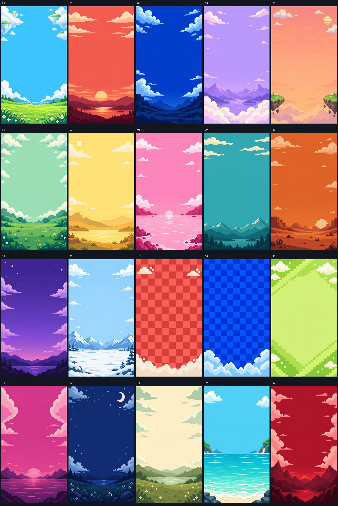

# Background library

20 new original AI-generated portrait pixel scenes, plus the earlier two checker PNGs. No private image reference used. Exact generation prompts: `assets/backgrounds/prompts.json`; paths, dimensions, provenance and hashes: `assets/backgrounds/catalog.json`.



| ID | Scene |
|---|---|
| 01-cyan-cloud-meadow | bright cyan sky, large stepped white cloud islands framing the upper corners, low lime-green meadow with tiny pixel flowers, clear open center |
| 02-red-sunset-clouds | coral-red sunset sky, cream stepped clouds stretched horizontally, low burgundy rolling hills, clear open center |
| 03-cobalt-cloud-stairs | deep cobalt-blue sky, chunky luminous pale-blue clouds arranged diagonally near the edges, very low dark-blue stepped terrain, open center |
| 04-lavender-cloud-sea | lavender sky, fluffy blocky ivory cloud banks at the lower edge, distant lilac pixel mountains, open center |
| 05-peach-floating-islands | warm peach sky, two tiny grassy floating pixel islands at the lower corners, sparse blocky white clouds at top, open center |
| 06-mint-cloud-window | mint-green sky, pixel cloud arch along top and sides, low emerald stepped meadow, very clear center |
| 07-yellow-sun-clouds | butter-yellow sky, soft warm-white stepped clouds, a small square sun near upper left edge, low ochre hills, open center |
| 08-pink-cloud-coast | bubblegum-pink sky, white stepped clouds, low raspberry pixel coastline and pale pink water, open center |
| 09-teal-cloud-horizon | teal sky, long narrow cream pixel cloud strips near top, distant deep-teal mountain horizon at bottom, open center |
| 10-orange-desert-clouds | burnt-orange sky, pale peach pixel clouds, low terracotta stepped desert dunes, open center |
| 11-violet-night-clouds | violet evening sky, pale lavender stepped clouds at sides, few tiny square stars, low dark purple hills, open center |
| 12-ice-blue-snow-clouds | icy light-blue sky, crisp white pixel clouds, low snowy blue mountains and snowfield, open center |
| 13-red-pixel-checker | red and coral checkerboard, medium-large square tiles, a thin stepped cream cloud bank at bottom and two small cloud accents near top corners, open center |
| 14-blue-pixel-checker | royal-blue and cobalt checkerboard, medium-large square tiles, broad pale-blue pixel clouds along bottom edge only, open center |
| 15-lime-diagonal-tiles | lime and light chartreuse geometric diagonal pixel steps, restrained repeating pattern, sparse ivory pixel clouds framing top, open center |
| 16-magenta-cloud-portals | magenta sky, two oversized stepped pale-pink cloud arcs entering from opposite sides, low plum horizon, open center |
| 17-indigo-moon-clouds | indigo-blue night sky, a small blocky cream crescent moon upper right, pale blue cloud islands at corners, low navy meadow, open center |
| 18-cream-green-clouds | warm cream sky, sage and mint stepped clouds like graphic cut-paper pixel shapes, low olive-green hills, open center |
| 19-aqua-pixel-ripples | aqua sky, low turquoise water with crisp horizontal pixel ripple lines, two white blocky clouds at upper corners, open center |
| 20-ruby-cloud-mountains | ruby-red sky, pale blush blocky clouds framing sides, low wine-red angular pixel mountain silhouettes, open center |

## Selection and motion
```javascript
PV.background(comp, '04-lavender-cloud-sea');
// Or choose a plate for a whole editable card:
PV.card('brief', 4.8, {background:'17-indigo-moon-clouds'});
```

Generated plates import through `PV.plateBackground`; they receive native position/rotation tracks with 20% overscan. Use them before foreground layers. The clouds in each PNG are painted into the same image: camera drift is not separate cloud animation. To animate clouds independently, generate a matching transparent cloud cutout or build native cloud layers and keep them separate. Do not promise parallax from a single flat image.

Original native environments remain: `sky`, `checker`, `red-checker`, `blue-checker`. Raster import accepts only the explicit library IDs. Never assume a generated texture is seamless: do not tile the PNG. Inspect all edges during movement.

Run `scripts/build-background-catalog.jsx` in AE for a 40-second editable background catalog. Runtime/visual render is pending; code and assets are checked separately. Use a chosen scene deliberately, not random palette switching every second.
